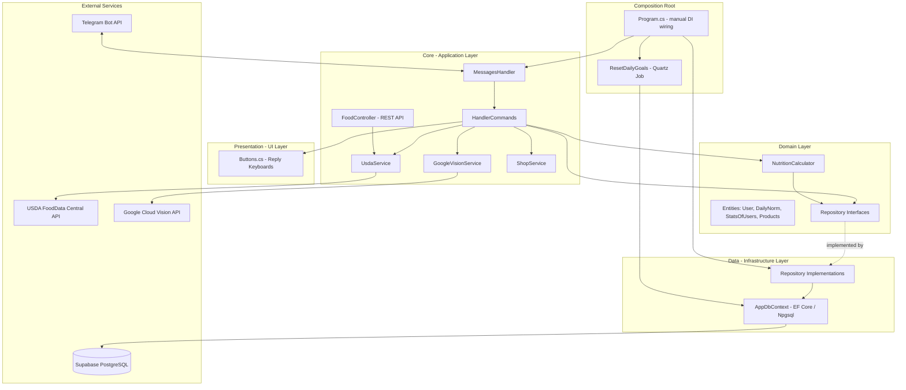

# 🥗 Healthy Nutrition Bot


-3ECF8E?style=flat&logo=supabase&logoColor=white)


A Telegram bot that helps people track their daily nutrition. Users fill in a short questionnaire (height, weight, gender, goal, activity level), get a personalized daily calorie/macro target, and then log meals simply by **sending a photo of their food** — the bot recognizes it, pulls up nutritional data, updates the daily counters, and rewards healthy choices with points that can be spent in an in-bot shop.

Built as a learning/portfolio project to practice **Clean Architecture**, **SOLID principles**, and classic **design patterns** in a real, working C# application.

---

## Table of Contents

- [Features](#features)
- [Tech Stack](#tech-stack)
- [Architecture](#architecture)
- [SOLID Principles & Design Patterns in Practice](#solid-principles--design-patterns-in-practice)
- [Project Structure](#project-structure)
- [Data Model](#data-model)
- [How the Bot Works](#how-the-bot-works)
- [Getting Started](#getting-started)
- [Scheduled Jobs](#scheduled-jobs)
- [External Integrations](#external-integrations)
- [Notes & Possible Improvements](#notes--possible-improvements)

---

## Features

- 📋 **Onboarding questionnaire** — a small finite-state flow collects height, weight, gender, goal (lose / maintain / gain) and activity level.
- 🔥 **Personalized daily targets** — calories, protein, fat and carbs are calculated from a BMR/TDEE-based formula and stored per user.
- 📸 **Photo-based food logging** — send a picture of your meal, the bot recognizes it (Google Cloud Vision), looks up its nutritional profile (USDA FoodData Central), and adds it to your daily totals.
- 🏆 **Gamification** — nutritionally "healthy" meals earn points and shop points based on a simple scoring heuristic (calories, fat, protein, carbs, fiber).
- 🛒 **In-bot shop** — spend earned points on products via native **Telegram Payments** (invoices, pre-checkout and successful-payment handling).
- 📊 **Stats & Daily Goal views** — check current progress against your personal targets at any time.
- ⏰ **Automatic daily reset** — a scheduled job clears the "today" counters every midnight (Europe/Kyiv).
- ⚙️ **Editable profile** — update your stats at any time; nutrition targets are recalculated automatically.

## Tech Stack

| Category | Technology |
|---|---|
| Language / Runtime | C#, .NET 10 |
| Bot framework | [Telegram.Bot](https://github.com/TelegramBots/Telegram.Bot) 18.1 |
| Database | PostgreSQL, hosted on [Supabase](https://supabase.com/) |
| Data access | Entity Framework Core + Npgsql |
| Scheduling | Quartz.NET 3.14 |
| Config | DotNetEnv (`.env` files) |
| Serialization | System.Text.Json / Newtonsoft.Json |
| External APIs | USDA FoodData Central, Google Cloud Vision, Telegram Payments |
| Testing | Moq (unit-testing support for services/repositories) |
| Optional REST layer | ASP.NET Core MVC (`FoodController`) + Swashbuckle |

## Architecture

The project follows a **Clean Architecture**-inspired layering: the domain sits at the center with no dependency on frameworks, application logic (Telegram handlers and external-service clients) wraps around it, and infrastructure (EF Core/Postgres) plus presentation (Telegram keyboards) sit at the outer edges. `Program.cs` acts as the **composition root**, manually wiring every dependency together (constructor injection, no IoC container).



**Layers, outer to inner:**

- **UI** (`UI/`) — Telegram reply keyboards, purely presentational, no logic.
- **Core** (`Core/`) — application layer: `handlers` translate Telegram updates into use cases, `service` wraps every external integration (USDA, Google Vision, Shop/Payments, token/config reading), `controllers` exposes an optional REST endpoint over the same services.
- **Domain** (`domain/`) — the heart of the app: entities, repository *interfaces* (abstractions only), and framework-agnostic business rules (`NutritionCalculator`).
- **Data** (`Data/`) — infrastructure layer: `AppDbContext` (EF Core) and the repository *implementations* that fulfill the domain interfaces against Supabase's Postgres database.
- **Program.cs** — composition root: builds the object graph by hand and starts the Telegram long-polling loop plus the Quartz scheduler.

## SOLID Principles & Design Patterns in Practice

The project was used specifically to practice the following principles/patterns end-to-end, not just as buzzwords:

**Dependency Injection (constructor injection)**
Every class receives its collaborators through its constructor rather than creating them itself — `HandlerCommands`, `MessagesHandler`, `NutritionCalculator` and every repository all take their dependencies (interfaces, `AppDbContext`, services) as constructor parameters. There's no IoC container; `Program.cs` composes the whole dependency graph by hand ("poor man's DI"), which keeps the wiring explicit and easy to follow while still gaining testability and loose coupling.

**Single Responsibility Principle**
Each class owns exactly one concern: `MessagesHandler` only routes incoming Telegram updates, `HandlerCommands` only orchestrates use cases, `UsdaService` only talks to the USDA API, `GoogleVisionService` only talks to Google Vision, `ShopService` only handles Telegram Payments, `NutritionCalculator` only computes nutrition math, and each repository only persists its own entity.

**Open/Closed Principle**
Business logic depends on abstractions (`IUserRepository`, `IDailyNormRepository`, `IStatsOfUsersRepository`, `IProductsRepository`) rather than concrete EF Core code. A new data source, scoring rule, or scheduled job can be introduced by adding a new implementation or a new Quartz `IJob`, without modifying the consumers that already depend on the existing interfaces.

**Interface Segregation Principle**
Instead of one large repository interface, each aggregate gets its own small, purpose-built interface (`IUserRepository` exposes only `GetUserById` / `AddUserAsync`, `IDailyNormRepository` only what's needed to read/update daily norms, etc.), so consumers never depend on methods they don't use.

**Repository Pattern**
`domain/interfaces` defines persistence contracts, and `domain/repositories` implements them on top of `AppDbContext`. This keeps EF Core/Postgres/Supabase-specific details out of the handlers and business logic entirely, and makes the data layer swappable and mockable (the project references **Moq** for exactly this purpose).

## Project Structure

```
healthy_nutrition_bot/
├── Core/
│   ├── controllers/          # Optional REST API (FoodController)
│   ├── handlers/              # MessagesHandler, HandlerCommands - Telegram use cases
│   └── service/                # UsdaService, GoogleVisionService, ShopService, TokenReader
├── Data/
│   ├── AppDbContext.cs         # EF Core DbContext (Npgsql -> Supabase Postgres)
│   └── supabase/                # Supabase client wrapper + legacy query helpers
├── domain/
│   ├── entities/                # User, DailyNorm, StatsOfUsers, Products, USDA DTOs
│   ├── interfaces/              # Repository abstractions (Repository Pattern / DIP)
│   ├── repositories/            # EF Core-based repository implementations
│   └── utils/                   # NutritionCalculator, ResetDailyGoals (Quartz job)
├── UI/
│   └── Buttons.cs               # Telegram reply-keyboard layouts
├── Program.cs                  # Composition root + bot & scheduler bootstrap
└── healthy_nutrition_bot.csproj
```

## Data Model

Four tables live in the Supabase Postgres database, mapped via EF Core data annotations:

| Table | Key columns | Purpose |
|---|---|---|
| `users` | `telegram_id`, `name`, `lastname`, `created_at`, `isActive` | Registered Telegram users |
| `stats_of_users` | `telegram_id`, `height`, `weight`, `gender`, `goal`, `activity`, `points`, `shoppoints` | Profile used to compute nutrition targets + gamification score |
| `daily_norm` | `telegram_id`, `calories`/`protein`/`fats`/`carbs`, `calories_today`/`protein_today`/`fat_today`/`carbs_today` | Daily target vs. current daily intake |
| `products` | `name`, `price`, `currency`, `img_url` | Items sellable through the in-bot Shop (Telegram Payments) |

## How the Bot Works

1. **`/start`** — registers the user (if new) and kicks off a short questionnaire: height → weight → gender → goal → activity level. Answers can be cancelled at any point with "Cancel"/"Back".
2. On completion, `NutritionCalculator` computes a BMR/TDEE-based daily target (calories, protein, fat, carbs) and stores it via `IDailyNormRepository`.
3. **Main menu** (reply keyboard): `Eat`, `Daily Goal`, `Stats`, `Shop`, `Settings`, `Help`.
   - **Eat** → the bot asks for a food photo. It's sent to **Google Cloud Vision** for label detection, the recognized label is looked up in **USDA FoodData Central**, and the returned macros are added to today's totals. A simple heuristic marks the food as "healthy" (based on calories/fat/protein/carbs/fiber thresholds) and rewards **+50 points / +50 shop points** when it is.
   - **Daily Goal** — shows today's intake vs. the personal target.
   - **Stats** — shows height/weight/gender/goal/activity plus accumulated points.
   - **Shop** — lists products from the `products` table as Telegram invoices; payment is handled through Telegram's native Payments flow.
   - **Settings → Change own stats** — re-runs the questionnaire and recalculates targets.
4. A background job (see below) resets the "today" counters every midnight so tracking starts fresh each day.

## Getting Started

### Prerequisites

- [.NET 10 SDK](https://dotnet.microsoft.com/)
- A Telegram bot token from [@BotFather](https://t.me/BotFather)
- A [Supabase](https://supabase.com/) project (Postgres connection string)
- A USDA FoodData Central API key ([api.nal.usda.gov](https://fdc.nal.usda.gov/api-guide.html))
- A Google Cloud Vision API key

### Setup

```bash
git clone https://github.com/marrttao/healthy_nutrition_bot.git
cd healthy_nutrition_bot/healthy_nutrition_bot
```

Create a `.env` file in the project directory:

```env
TELEGRAM_TOKEN=your_telegram_bot_token
SUPABASE_URL=your_supabase_project_url
SUPABASE_KEY=your_supabase_api_key
SUPABASE_CONNECTION_STRING=your_postgres_connection_string
GOOGLE_VISION_API=your_google_vision_api_key
USDA_API_KEY=your_usda_api_key
PROVIDER_TOKEN=your_telegram_payments_provider_token
```

Make sure the `users`, `stats_of_users`, `daily_norm` and `products` tables exist in your Supabase database (matching the [Data Model](#data-model) above) — create them via the Supabase SQL editor, or generate them from the EF Core models with:

```bash
dotnet ef migrations add Init
dotnet ef database update
```

Then restore and run:

```bash
dotnet restore
dotnet run
```

On success you should see `Бот <username> запущен.` in the console, and the bot will start responding on Telegram.

## Scheduled Jobs

A **Quartz.NET** job (`ResetDailyGoals`) is scheduled at startup with a cron trigger to run every day at **00:00, Europe/Kyiv time zone**. It bulk-updates the `daily_norm` table, zeroing out `calories_today`, `protein_today`, `fat_today` and `carbs_today` for every user in a single query.

## External Integrations

| Service | Used for |
|---|---|
| Telegram Bot API | Messaging, keyboards, photo upload, Telegram Payments |
| USDA FoodData Central | Nutritional values (calories, protein, fat, carbs, fiber) for a recognized food |
| Google Cloud Vision | Label detection on food photos |
| Supabase (PostgreSQL) | Primary data store, accessed through EF Core/Npgsql |

## Notes & Possible Improvements

- The project also contains an optional ASP.NET Core Web API controller (`FoodController`, with Swashbuckle referenced) exposing food search over HTTP — it reuses `UsdaService` and can be hosted separately from the console bot if a REST layer is needed.
- A legacy `SupabaseService` (official `supabase-csharp` client) is still present alongside EF Core/Npgsql; the current data flow relies on EF Core, so the Supabase client can be considered optional/for future use (e.g. Realtime features).
- `Moq` is referenced for unit testing services and repositories against their interfaces — a natural next step is adding a dedicated test project.
- Food logging currently relies on a single recognized label per photo; matching against multiple candidate labels could improve accuracy for ambiguous meals.
